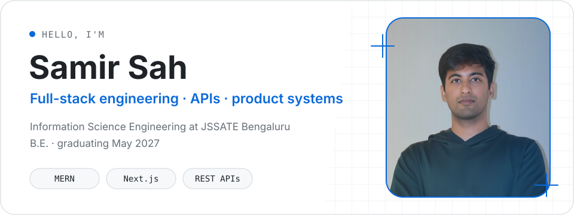

<picture>
  <source media="(prefers-color-scheme: dark)" srcset="assets/hero-dark.svg">
  <source media="(prefers-color-scheme: light)" srcset="assets/hero-light.svg">
  
</picture>

## Engineering focus

I build full-stack product systems with **MERN and Next.js**, with particular attention to **REST APIs**, durable data models in **MongoDB**, and deployment on **AWS EC2**.

I am pursuing a **B.E. in Information Science Engineering at JSSATE Bengaluru**, graduating in **May 2027**. Alongside engineering, I serve as **General Secretary of MUNSOC JSSATE** and have solved **200+ DSA problems**.

## Focused toolbox

| Layer              | Tools                         |
| ------------------ | ----------------------------- |
| Product interfaces | Next.js · React               |
| Application layer  | Node.js · Express · REST APIs |
| Data               | MongoDB                       |
| Delivery           | AWS EC2 · Git · GitHub        |

## Currently building

- Full-stack products where interface, API, and data model evolve as one system.
- Clear REST APIs backed by MongoDB and deployed on AWS EC2.
- Stronger problem-solving foundations through continued DSA practice.

## Selected projects

> The repositories listed in the local project catalogue were not publicly reachable when this profile was refreshed, so the work is presented without fragile repository links or invented metrics.

### Business Admin Dashboard

A full-stack admin dashboard for business data and operations, with structured RESTful APIs and a responsive Next.js/Tailwind frontend.

### CRM Platform

A full-stack CRM for leads, contacts, notes, and follow-up tasks, organized around a Kanban-based sales pipeline with JWT authentication.

## Activity

My public GitHub profile is the source of truth for current repositories and contribution activity. No counters or generated scorecards here—just the work as it evolves.

[View GitHub profile →](https://github.com/samir-sah)

## Connect

[Portfolio](https://samir-sah.vercel.app) · [LinkedIn](https://linkedin.com/in/samir-sah-68a8b3329) · [LeetCode](https://leetcode.com/samir-sah) · [Email](mailto:sahsamir2004@gmail.com)
