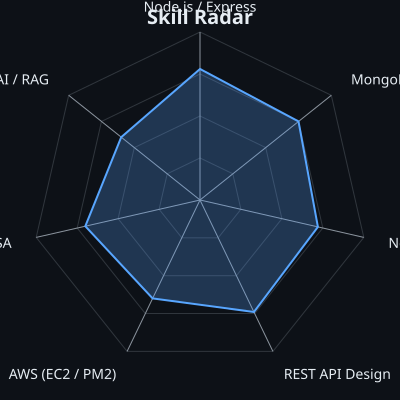
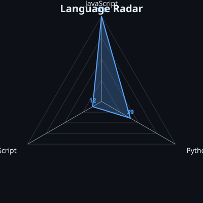
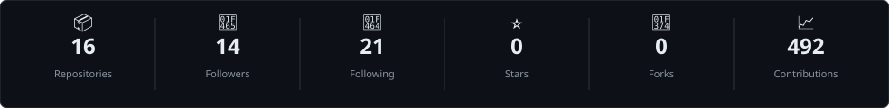
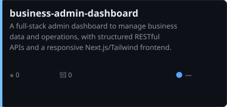
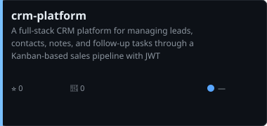
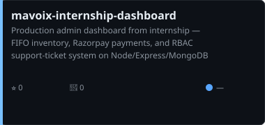
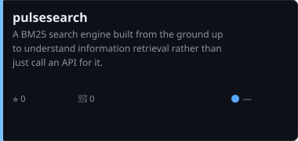

# Samir Sah

**Final-year B.E. Information Science Engineering student, JSSATE Bengaluru — graduating May 2027**

<picture>
  <source media="(prefers-color-scheme: dark)" srcset="assets/portrait-dark.svg">
  <source media="(prefers-color-scheme: light)" srcset="assets/portrait-light.svg">
  
</picture>

---

### whoami

- Final-year Information Science student at JSSATE Bengaluru (Class of 2027)
- Full-stack engineer: MERN stack, Next.js, REST APIs, MongoDB, AWS EC2
- 200+ DSA problems solved; SSB Conference Stage (IAF/AFCAT track)
- General Secretary, MUNSOC JSSATE — led 200+ member student body
- CBSE Zonal Badminton representative, Mumbai Region

---

### Toolbox

---

### Radars

<table>
<tr>
<td align="center">
<picture>
  <source media="(prefers-color-scheme: dark)" srcset="assets/radar-skills-dark.svg">
  <source media="(prefers-color-scheme: light)" srcset="assets/radar-skills-light.svg">
  
</picture>
</td>
<td align="center">
<picture>
  <source media="(prefers-color-scheme: dark)" srcset="assets/radar-langs-dark.svg">
  <source media="(prefers-color-scheme: light)" srcset="assets/radar-langs-light.svg">
  
</picture>
</td>
</tr>
<tr>
<td align="center"><strong>Self-rated Skills</strong></td>
<td align="center"><strong>GitHub Language Stats</strong></td>
</tr>
</table>

---

### Activity

<table>
<tr>
<td align="center">

</td>
<td align="center">
<picture>
  <source media="(prefers-color-scheme: dark)" srcset="https://raw.githubusercontent.com/samir-sah/samir-sah/output/snake-dark.svg">
  <source media="(prefers-color-scheme: light)" srcset="https://raw.githubusercontent.com/samir-sah/samir-sah/output/snake-light.svg">
  
</picture>
</td>
</tr>
<tr>
<td align="center"><strong>Contribution Calendar</strong></td>
<td align="center"><strong>Snake Game</strong></td>
</tr>
</table>

---

### Stats

<picture>
  <source media="(prefers-color-scheme: dark)" srcset="assets/card-stats-dark.svg">
  <source media="(prefers-color-scheme: light)" srcset="assets/card-stats-light.svg">
  
</picture>

---

### Projects

<table>
<tr>
<td align="center">
<a href="https://github.com/samir-sah/business-admin-dashboard">
<picture>
  <source media="(prefers-color-scheme: dark)" srcset="assets/card-project-business-admin-dashboard-dark.svg">
  <source media="(prefers-color-scheme: light)" srcset="assets/card-project-business-admin-dashboard-light.svg">
  
</picture>
</a>
</td>
<td align="center">
<a href="https://github.com/samir-sah/crm-platform">
<picture>
  <source media="(prefers-color-scheme: dark)" srcset="assets/card-project-crm-platform-dark.svg">
  <source media="(prefers-color-scheme: light)" srcset="assets/card-project-crm-platform-light.svg">
  
</picture>
</a>
</td>
</tr>
<tr>
<td align="center">
<a href="https://github.com/samir-sah/mavoix-internship-dashboard">
<picture>
  <source media="(prefers-color-scheme: dark)" srcset="assets/card-project-mavoix-internship-dashboard-dark.svg">
  <source media="(prefers-color-scheme: light)" srcset="assets/card-project-mavoix-internship-dashboard-light.svg">
  
</picture>
</a>
</td>
<td align="center">
<a href="https://github.com/samir-sah/pulsesearch">
<picture>
  <source media="(prefers-color-scheme: dark)" srcset="assets/card-project-pulsesearch-dark.svg">
  <source media="(prefers-color-scheme: light)" srcset="assets/card-project-pulsesearch-light.svg">
  
</picture>
</a>
</td>
</tr>
</table>

| Project | Stack | Description |
|---------|-------|-------------|
| [Business Admin Dashboard](https://github.com/samir-sah/business-admin-dashboard) | Next.js, Tailwind, Node.js, Express, MongoDB | Full-stack admin dashboard with RESTful APIs and responsive UI |
| [CRM Platform](https://github.com/samir-sah/crm-platform) | React, Tailwind, Node.js, Express, MongoDB, JWT | Kanban-based sales pipeline with leads, contacts, and follow-ups |
| [Mavoix Internship Dashboard](https://github.com/samir-sah/mavoix-internship-dashboard) | Node.js, Express, MongoDB, AWS EC2, Razorpay | Production dashboard with FIFO inventory, payments, RBAC tickets |
| [PulseSearch](https://github.com/samir-sah/pulsesearch) | Python, BM25 | From-scratch search engine for understanding information retrieval |

---

Generated by <a href="https://github.com/samir-sah/samir-sah">samir-sah/samir-sah</a> · Updated daily via GitHub Actions
